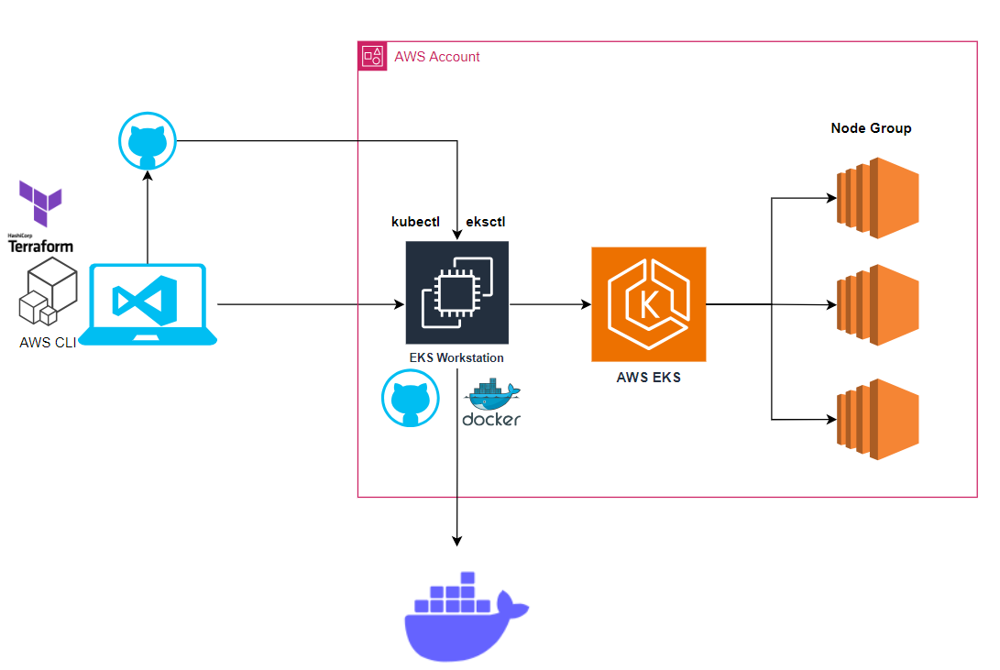
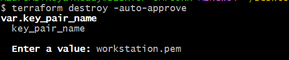

---

# EKS Workstation Setup using Terraform



This document provides an overview of the EKS workstation setup using Terraform and highlights the utilities installed for managing an AWS EKS cluster.

---

## **Overview**
This setup provisions an EC2 instance as an EKS workstation. The instance is pre-configured with essential tools and utilities for managing and interacting with an EKS cluster. All configurations, including SSH key pairs and software installations, are automated using Terraform and a shell script.

---

## **Key Features**
1. **Automated Provisioning**:
   - The EC2 instance is provisioned with Terraform.
   - An SSH key pair is automatically generated using the `tls_private_key` resource.

2. **Pre-installed Utilities**:
   The following utilities are installed on the instance:
   - **Git**: For version control.
   - **Docker**: For containerization.
   - **Docker Compose**: For orchestrating multi-container applications.
   - **eksctl**: A CLI tool for creating and managing EKS clusters.
   - **kubectl**: A CLI tool for interacting with Kubernetes clusters.

3. **Shell Script Execution**:
   - The installation of all utilities is managed by a shell script (`workstation.sh`).
   - This script is executed automatically using the `user_data` property of the EC2 instance.

4. **EKS Cluster Access**:
   - The instance is configured to interact with AWS EKS clusters.
   - AWS CLI and required IAM roles/policies are set up to enable seamless access to the EKS cluster.

---

## **Setup Process**
### 1. **Terraform Configuration**:
   - Terraform provisions the following resources:
     - An EC2 instance.
     - An SSH key pair for secure access.
     - A security group allowing necessary traffic.

### 2. **Shell Script**:
   - The `workstation.sh` script is executed during instance initialization.
   - The script installs the utilities listed above.

### 3. **Accessing the Instance**:
   - Use the generated private key to SSH into the instance:
     ```bash
     ssh -i <private_key_file> ec2-user@<instance_ip>
     ```

### 4. **Interacting with EKS**:
   - Use `eksctl` and `kubectl` from the instance to manage your EKS cluster.
   - Example:
     ```bash
     eksctl get cluster
     kubectl get nodes
     ```

---

## **Pre-requisites**
1. **Terraform Installed**: Ensure Terraform is installed on your local machine.
2. **AWS CLI Configured**: The AWS CLI should be configured with appropriate credentials and region.
3. **IAM Permissions**:
   - The IAM role associated with the instance must have permissions to manage EKS clusters.

---

## **Usage Instructions**
1. Clone the Terraform configuration repository.
2. Update the `key_pair_name` variable with your desired key pair name.
3. Run the following commands:
   ```bash
   terraform init
   terraform apply
   ```
   

4. SSH into the instance and verify the tools:
   ```bash
   git --version
   docker --version
   eksctl version
   kubectl version
   ```

---

## **Validation**
- Confirm the EC2 instance is running and accessible.
- Ensure all utilities are installed and functional by executing relevant commands from the instance.
- Verify EKS cluster connectivity using `eksctl` and `kubectl`.

---

This setup ensures a ready-to-use environment for managing AWS EKS clusters efficiently.